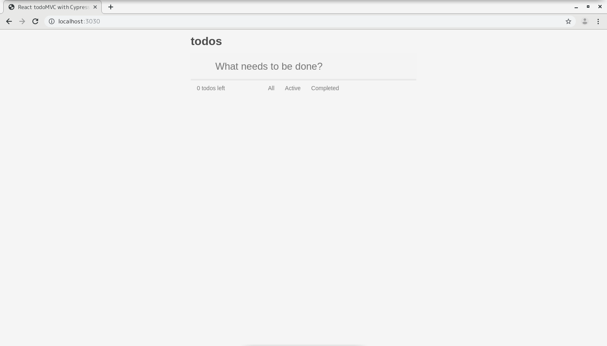

- 「https://github.com/cypress-io/cypress-tutorial-build-todo-starter.git 」をフォークしたリポジトリをクローン

```
cd cypress-tutorial-build-todo-starter
npm install
```

- 以下の警告が表示された。

```

> uglifyjs-webpack-plugin@0.4.6 postinstall /home/vagrant/cypress/tutorial/cypress-tutorial-build-todo-starter/node_modules/uglifyjs-webpack-plugin
> node lib/post_install.js


> cypress@3.3.2 postinstall /home/vagrant/cypress/tutorial/cypress-tutorial-build-todo-starter/node_modules/cypress
> node index.js --exec install


Cypress 3.3.2 is installed in /home/vagrant/.cache/Cypress/3.3.2

npm WARN cypress-tutorial-build-todo-starter@1.0.0 No repository field.
npm WARN optional SKIPPING OPTIONAL DEPENDENCY: fsevents@1.1.2 (node_modules/fsevents):
npm WARN notsup SKIPPING OPTIONAL DEPENDENCY: Unsupported platform for fsevents@1.1.2: wanted {"os":"darwin","arch":"any"} (current: {"os":"linux","arch":"x64"})

added 867 packages from 651 contributors and audited 4792 packages in 47.118s
found 512 vulnerabilities (166 low, 15 moderate, 330 high, 1 critical)
  run `npm audit fix` to fix them, or `npm audit` for details
```

- 指示に従って以下のコマンドを実行

```
npm audit fix
```

- さらに以下の警告が表示された。

```
npm WARN ajv-keywords@2.1.0 requires a peer of ajv@>=5.0.0 but none is installed. You must install peer dependencies yourself.
npm WARN cypress-tutorial-build-todo-starter@1.0.0 No repository field.
npm WARN optional SKIPPING OPTIONAL DEPENDENCY: fsevents@1.2.9 (node_modules/watchpack/node_modules/fsevents):
npm WARN notsup SKIPPING OPTIONAL DEPENDENCY: Unsupported platform for fsevents@1.2.9: wanted {"os":"darwin","arch":"any"} (current: {"os":"linux","arch":"x64"})

+ axios@0.19.0
added 129 packages from 62 contributors, removed 30 packages, updated 13 packages and moved 6 packages in 26.282s
fixed 501 of 512 vulnerabilities in 4792 scanned packages
  9 vulnerabilities required manual review and could not be updated
  1 package update for 2 vulns involved breaking changes
  (use `npm audit fix --force` to install breaking changes; or refer to `npm audit` for steps to fix these manually)
```

- 以下のコマンドを実行

```
npm audit
```

- 以下の出力になった。

```
                                                                                
                       === npm audit security report ===                        
                                                                                
# Run  npm install --save-dev css-loader@3.1.0  to resolve 2 vulnerabilities
SEMVER WARNING: Recommended action is a potentially breaking change
┌───────────────┬──────────────────────────────────────────────────────────────┐
│ Moderate      │ Denial of Service                                            │
├───────────────┼──────────────────────────────────────────────────────────────┤
│ Package       │ js-yaml                                                      │
├───────────────┼──────────────────────────────────────────────────────────────┤
│ Dependency of │ css-loader [dev]                                             │
├───────────────┼──────────────────────────────────────────────────────────────┤
│ Path          │ css-loader > cssnano > postcss-svgo > svgo > js-yaml         │
├───────────────┼──────────────────────────────────────────────────────────────┤
│ More info     │ https://npmjs.com/advisories/788                             │
└───────────────┴──────────────────────────────────────────────────────────────┘


┌───────────────┬──────────────────────────────────────────────────────────────┐
│ High          │ Code Injection                                               │
├───────────────┼──────────────────────────────────────────────────────────────┤
│ Package       │ js-yaml                                                      │
├───────────────┼──────────────────────────────────────────────────────────────┤
│ Dependency of │ css-loader [dev]                                             │
├───────────────┼──────────────────────────────────────────────────────────────┤
│ Path          │ css-loader > cssnano > postcss-svgo > svgo > js-yaml         │
├───────────────┼──────────────────────────────────────────────────────────────┤
│ More info     │ https://npmjs.com/advisories/813                             │
└───────────────┴──────────────────────────────────────────────────────────────┘


┌──────────────────────────────────────────────────────────────────────────────┐
│                                Manual Review                                 │
│            Some vulnerabilities require your attention to resolve            │
│                                                                              │
│         Visit https://go.npm.me/audit-guide for additional guidance          │
└──────────────────────────────────────────────────────────────────────────────┘
┌───────────────┬──────────────────────────────────────────────────────────────┐
│ Moderate      │ Prototype Pollution                                          │
├───────────────┼──────────────────────────────────────────────────────────────┤
│ Package       │ hoek                                                         │
├───────────────┼──────────────────────────────────────────────────────────────┤
│ Patched in    │ > 4.2.0 < 5.0.0 || >= 5.0.3                                  │
├───────────────┼──────────────────────────────────────────────────────────────┤
│ Dependency of │ json-server                                                  │
├───────────────┼──────────────────────────────────────────────────────────────┤
│ Path          │ json-server > request > hawk > boom > hoek                   │
├───────────────┼──────────────────────────────────────────────────────────────┤
│ More info     │ https://npmjs.com/advisories/566                             │
└───────────────┴──────────────────────────────────────────────────────────────┘
┌───────────────┬──────────────────────────────────────────────────────────────┐
│ Moderate      │ Prototype Pollution                                          │
├───────────────┼──────────────────────────────────────────────────────────────┤
│ Package       │ hoek                                                         │
├───────────────┼──────────────────────────────────────────────────────────────┤
│ Patched in    │ > 4.2.0 < 5.0.0 || >= 5.0.3                                  │
├───────────────┼──────────────────────────────────────────────────────────────┤
│ Dependency of │ json-server                                                  │
├───────────────┼──────────────────────────────────────────────────────────────┤
│ Path          │ json-server > request > hawk > cryptiles > boom > hoek       │
├───────────────┼──────────────────────────────────────────────────────────────┤
│ More info     │ https://npmjs.com/advisories/566                             │
└───────────────┴──────────────────────────────────────────────────────────────┘
┌───────────────┬──────────────────────────────────────────────────────────────┐
│ Moderate      │ Prototype Pollution                                          │
├───────────────┼──────────────────────────────────────────────────────────────┤
│ Package       │ hoek                                                         │
├───────────────┼──────────────────────────────────────────────────────────────┤
│ Patched in    │ > 4.2.0 < 5.0.0 || >= 5.0.3                                  │
├───────────────┼──────────────────────────────────────────────────────────────┤
│ Dependency of │ json-server                                                  │
├───────────────┼──────────────────────────────────────────────────────────────┤
│ Path          │ json-server > request > hawk > hoek                          │
├───────────────┼──────────────────────────────────────────────────────────────┤
│ More info     │ https://npmjs.com/advisories/566                             │
└───────────────┴──────────────────────────────────────────────────────────────┘
┌───────────────┬──────────────────────────────────────────────────────────────┐
│ Moderate      │ Prototype Pollution                                          │
├───────────────┼──────────────────────────────────────────────────────────────┤
│ Package       │ hoek                                                         │
├───────────────┼──────────────────────────────────────────────────────────────┤
│ Patched in    │ > 4.2.0 < 5.0.0 || >= 5.0.3                                  │
├───────────────┼──────────────────────────────────────────────────────────────┤
│ Dependency of │ json-server                                                  │
├───────────────┼──────────────────────────────────────────────────────────────┤
│ Path          │ json-server > request > hawk > sntp > hoek                   │
├───────────────┼──────────────────────────────────────────────────────────────┤
│ More info     │ https://npmjs.com/advisories/566                             │
└───────────────┴──────────────────────────────────────────────────────────────┘
┌───────────────┬──────────────────────────────────────────────────────────────┐
│ High          │ Prototype Pollution                                          │
├───────────────┼──────────────────────────────────────────────────────────────┤
│ Package       │ lodash                                                       │
├───────────────┼──────────────────────────────────────────────────────────────┤
│ Patched in    │ >=4.17.12                                                    │
├───────────────┼──────────────────────────────────────────────────────────────┤
│ Dependency of │ cypress [dev]                                                │
├───────────────┼──────────────────────────────────────────────────────────────┤
│ Path          │ cypress > lodash                                             │
├───────────────┼──────────────────────────────────────────────────────────────┤
│ More info     │ https://npmjs.com/advisories/1065                            │
└───────────────┴──────────────────────────────────────────────────────────────┘
found 7 vulnerabilities (5 moderate, 2 high) in 6601 scanned packages
  2 vulnerabilities require semver-major dependency updates.
  5 vulnerabilities require manual review. See the full report for details.
```

- 以下を実行

```
npm install --save-dev css-loader@3.1.0
```

- 以下の出力になった。

```
npm WARN ajv-keywords@2.1.0 requires a peer of ajv@>=5.0.0 but none is installed. You must install peer dependencies yourself.
npm WARN css-loader@3.1.0 requires a peer of webpack@^4.0.0 but none is installed. You must install peer dependencies yourself.
npm WARN cypress-tutorial-build-todo-starter@1.0.0 No repository field.
npm WARN optional SKIPPING OPTIONAL DEPENDENCY: fsevents@1.2.9 (node_modules/watchpack/node_modules/fsevents):
npm WARN notsup SKIPPING OPTIONAL DEPENDENCY: Unsupported platform for fsevents@1.2.9: wanted {"os":"darwin","arch":"any"} (current: {"os":"linux","arch":"x64"})

+ css-loader@3.1.0
added 11 packages from 11 contributors, removed 99 packages, updated 14 packages, moved 1 package and audited 6116 packages in 17.78s
found 5 vulnerabilities (4 moderate, 1 high)
  run `npm audit fix` to fix them, or `npm audit` for details
```

- 以下を実行

```
npm audit fix
```

- 以下の出力になった。

```
npm WARN ajv-keywords@2.1.0 requires a peer of ajv@>=5.0.0 but none is installed. You must install peer dependencies yourself.
npm WARN css-loader@3.1.0 requires a peer of webpack@^4.0.0 but none is installed. You must install peer dependencies yourself.
npm WARN cypress-tutorial-build-todo-starter@1.0.0 No repository field.
npm WARN optional SKIPPING OPTIONAL DEPENDENCY: fsevents@1.2.9 (node_modules/watchpack/node_modules/fsevents):
npm WARN notsup SKIPPING OPTIONAL DEPENDENCY: Unsupported platform for fsevents@1.2.9: wanted {"os":"darwin","arch":"any"} (current: {"os":"linux","arch":"x64"})

up to date in 11.503s
fixed 0 of 5 vulnerabilities in 6116 scanned packages
  5 vulnerabilities required manual review and could not be updated
```

```
npm audit
```

```
                                                                                
                       === npm audit security report ===                        
                                                                                
┌──────────────────────────────────────────────────────────────────────────────┐
│                                Manual Review                                 │
│            Some vulnerabilities require your attention to resolve            │
│                                                                              │
│         Visit https://go.npm.me/audit-guide for additional guidance          │
└──────────────────────────────────────────────────────────────────────────────┘
┌───────────────┬──────────────────────────────────────────────────────────────┐
│ Moderate      │ Prototype Pollution                                          │
├───────────────┼──────────────────────────────────────────────────────────────┤
│ Package       │ hoek                                                         │
├───────────────┼──────────────────────────────────────────────────────────────┤
│ Patched in    │ > 4.2.0 < 5.0.0 || >= 5.0.3                                  │
├───────────────┼──────────────────────────────────────────────────────────────┤
│ Dependency of │ json-server                                                  │
├───────────────┼──────────────────────────────────────────────────────────────┤
│ Path          │ json-server > request > hawk > boom > hoek                   │
├───────────────┼──────────────────────────────────────────────────────────────┤
│ More info     │ https://npmjs.com/advisories/566                             │
└───────────────┴──────────────────────────────────────────────────────────────┘
┌───────────────┬──────────────────────────────────────────────────────────────┐
│ Moderate      │ Prototype Pollution                                          │
├───────────────┼──────────────────────────────────────────────────────────────┤
│ Package       │ hoek                                                         │
├───────────────┼──────────────────────────────────────────────────────────────┤
│ Patched in    │ > 4.2.0 < 5.0.0 || >= 5.0.3                                  │
├───────────────┼──────────────────────────────────────────────────────────────┤
│ Dependency of │ json-server                                                  │
├───────────────┼──────────────────────────────────────────────────────────────┤
│ Path          │ json-server > request > hawk > cryptiles > boom > hoek       │
├───────────────┼──────────────────────────────────────────────────────────────┤
│ More info     │ https://npmjs.com/advisories/566                             │
└───────────────┴──────────────────────────────────────────────────────────────┘
┌───────────────┬──────────────────────────────────────────────────────────────┐
│ Moderate      │ Prototype Pollution                                          │
├───────────────┼──────────────────────────────────────────────────────────────┤
│ Package       │ hoek                                                         │
├───────────────┼──────────────────────────────────────────────────────────────┤
│ Patched in    │ > 4.2.0 < 5.0.0 || >= 5.0.3                                  │
├───────────────┼──────────────────────────────────────────────────────────────┤
│ Dependency of │ json-server                                                  │
├───────────────┼──────────────────────────────────────────────────────────────┤
│ Path          │ json-server > request > hawk > hoek                          │
├───────────────┼──────────────────────────────────────────────────────────────┤
│ More info     │ https://npmjs.com/advisories/566                             │
└───────────────┴──────────────────────────────────────────────────────────────┘
┌───────────────┬──────────────────────────────────────────────────────────────┐
│ Moderate      │ Prototype Pollution                                          │
├───────────────┼──────────────────────────────────────────────────────────────┤
│ Package       │ hoek                                                         │
├───────────────┼──────────────────────────────────────────────────────────────┤
│ Patched in    │ > 4.2.0 < 5.0.0 || >= 5.0.3                                  │
├───────────────┼──────────────────────────────────────────────────────────────┤
│ Dependency of │ json-server                                                  │
├───────────────┼──────────────────────────────────────────────────────────────┤
│ Path          │ json-server > request > hawk > sntp > hoek                   │
├───────────────┼──────────────────────────────────────────────────────────────┤
│ More info     │ https://npmjs.com/advisories/566                             │
└───────────────┴──────────────────────────────────────────────────────────────┘
┌───────────────┬──────────────────────────────────────────────────────────────┐
│ High          │ Prototype Pollution                                          │
├───────────────┼──────────────────────────────────────────────────────────────┤
│ Package       │ lodash                                                       │
├───────────────┼──────────────────────────────────────────────────────────────┤
│ Patched in    │ >=4.17.12                                                    │
├───────────────┼──────────────────────────────────────────────────────────────┤
│ Dependency of │ cypress [dev]                                                │
├───────────────┼──────────────────────────────────────────────────────────────┤
│ Path          │ cypress > lodash                                             │
├───────────────┼──────────────────────────────────────────────────────────────┤
│ More info     │ https://npmjs.com/advisories/1065                            │
└───────────────┴──────────────────────────────────────────────────────────────┘
found 5 vulnerabilities (4 moderate, 1 high) in 6116 scanned packages
  5 vulnerabilities require manual review. See the full report for details.
```

```
npm ls hoek
```

```
<root>
└─┬ json-server@0.12.0
  └─┬ request@2.81.0
    └─┬ hawk@3.1.3
      ├─┬ boom@2.10.1
      │ └── hoek@2.16.3  deduped
      ├── hoek@2.16.3
      └─┬ sntp@1.0.9
        └── hoek@2.16.3  deduped
```

```
npm update json-server
```

```
npm WARN css-loader@3.1.0 requires a peer of webpack@^4.0.0 but none is installed. You must install peer dependencies yourself.
npm WARN cypress-tutorial-build-todo-starter@1.0.0 No repository field.
npm WARN optional SKIPPING OPTIONAL DEPENDENCY: fsevents@1.2.9 (node_modules/watchpack/node_modules/fsevents):
npm WARN notsup SKIPPING OPTIONAL DEPENDENCY: Unsupported platform for fsevents@1.2.9: wanted {"os":"darwin","arch":"any"} (current: {"os":"linux","arch":"x64"})

+ json-server@0.12.2
added 40 packages from 15 contributors, removed 35 packages, updated 72 packages, moved 1 package and audited 6076 packages in 8.61s
found 1 high severity vulnerability
  run `npm audit fix` to fix them, or `npm audit` for details
```

```
npm audit fix
```

```
npm WARN css-loader@3.1.0 requires a peer of webpack@^4.0.0 but none is installed. You must install peer dependencies yourself.
npm WARN cypress-tutorial-build-todo-starter@1.0.0 No repository field.
npm WARN optional SKIPPING OPTIONAL DEPENDENCY: fsevents@1.2.9 (node_modules/watchpack/node_modules/fsevents):
npm WARN notsup SKIPPING OPTIONAL DEPENDENCY: Unsupported platform for fsevents@1.2.9: wanted {"os":"darwin","arch":"any"} (current: {"os":"linux","arch":"x64"})

up to date in 11.897s
fixed 0 of 1 vulnerability in 6076 scanned packages
  1 vulnerability required manual review and could not be updated
```

```
npm audit
```

```
npm WARN css-loader@3.1.0 requires a peer of webpack@^4.0.0 but none is installed. You must install peer dependencies yourself.
npm WARN cypress-tutorial-build-todo-starter@1.0.0 No repository field.
npm WARN optional SKIPPING OPTIONAL DEPENDENCY: fsevents@1.2.9 (node_modules/watchpack/node_modules/fsevents):
npm WARN notsup SKIPPING OPTIONAL DEPENDENCY: Unsupported platform for fsevents@1.2.9: wanted {"os":"darwin","arch":"any"} (current: {"os":"linux","arch":"x64"})

up to date in 11.897s
fixed 0 of 1 vulnerability in 6076 scanned packages
  1 vulnerability required manual review and could not be updated
[vagrant@vm-centos7-01 cypress-tutorial-build-todo-starter]$ npm audit
                                                                                
                       === npm audit security report ===                        
                                                                                
┌──────────────────────────────────────────────────────────────────────────────┐
│                                Manual Review                                 │
│            Some vulnerabilities require your attention to resolve            │
│                                                                              │
│         Visit https://go.npm.me/audit-guide for additional guidance          │
└──────────────────────────────────────────────────────────────────────────────┘
┌───────────────┬──────────────────────────────────────────────────────────────┐
│ High          │ Prototype Pollution                                          │
├───────────────┼──────────────────────────────────────────────────────────────┤
│ Package       │ lodash                                                       │
├───────────────┼──────────────────────────────────────────────────────────────┤
│ Patched in    │ >=4.17.12                                                    │
├───────────────┼──────────────────────────────────────────────────────────────┤
│ Dependency of │ cypress [dev]                                                │
├───────────────┼──────────────────────────────────────────────────────────────┤
│ Path          │ cypress > lodash                                             │
├───────────────┼──────────────────────────────────────────────────────────────┤
│ More info     │ https://npmjs.com/advisories/1065                            │
└───────────────┴──────────────────────────────────────────────────────────────┘
found 1 high severity vulnerability in 6076 scanned packages
  1 vulnerability requires manual review. See the full report for details.
```

「./node_modules/cypress/package.json」内で以下のように定義されており、バージョンアップができないのではないか、という疑問からgithubのissueで質問中。

https://github.com/cypress-io/cypress-tutorial-build-todo-starter/issues/5

- 実行

```
npm run dev
```

- 以下の出力になった。

```
> cypress-tutorial-build-todo-starter@1.0.0 dev /home/vagrant/cypress-tutorial-build-todo-starter
> concurrently "npm run watch" "npm run serve"

[1]
[1] > cypress-tutorial-build-todo-starter@1.0.0 serve /home/vagrant/cypress-tutorial-build-todo-starter
[1] > json-server db.json
[1]
[0]
[0] > cypress-tutorial-build-todo-starter@1.0.0 watch /home/vagrant/cypress-tutorial-build-todo-starter
[0] > webpack --watch
[0]
[1] json-server requires at least version 4 of Node, please upgrade
[1] npm ERR! code ELIFECYCLE
[1] npm ERR! errno 1
[1] npm ERR! cypress-tutorial-build-todo-starter@1.0.0 serve: `json-server db.json`
[1] npm ERR! Exit status 1
[1] npm ERR!
[1] npm ERR! Failed at the cypress-tutorial-build-todo-starter@1.0.0 serve script.
[1] npm ERR! This is probably not a problem with npm. There is likely additional logging output above.
[1]
[1] npm ERR! A complete log of this run can be found in:
[1] npm ERR!     /home/vagrant/.npm/_logs/2019-07-23T12_02_59_161Z-debug.log
[1] npm run serve exited with code 1
[0]
[0] Webpack is watching the files…
[0]
[0] Hash: 27ad6b79146d5cc8660e
[0] Version: webpack 3.8.1
[0] Time: 1966ms
[0]             Asset       Size  Chunks                    Chunk Names
[0]     app.bundle.js    1.06 MB       0  [emitted]  [big]  main
[0] app.bundle.js.map    1.22 MB       0  [emitted]         main
[0]        index.html  292 bytes          [emitted]
[0]   [32] ./src/index.js 523 bytes {0} [built]
[0]   [86] ./src/styles.css 1.02 kB {0} [built]
[0]   [87] ./node_modules/css-loader/dist/cjs.js!./src/styles.css 7.28 kB {0} [built]
[0]     + 88 hidden modules
[0] Child html-webpack-plugin for "index.html":
[0]      1 asset
[0]        [0] ./node_modules/html-webpack-plugin/lib/loader.js!./src/index.html 598 bytes {0} [built]
[0]        [2] (webpack)/buildin/global.js 488 bytes {0} [built]
[0]        [3] (webpack)/buildin/module.js 495 bytes {0} [built]
[0]         + 1 hidden module
```

- 以下のように画面が起動した。



- 「./package.json」を以下のように編集する。

編集前

```
  "scripts": {
    // (略)
    "dev": "concurrently \"npm run watch\" \"npm run serve\""
  },
```

編集後

```
  "scripts": {
    // (略)
    "dev": "concurrently \"npm run watch\" \"npm run serve\"",
    "cypress": "cypress open"
  },
```

- 新しいタブで以下のコマンドを実行する。

```
npm run cypress
```

- 以下のように画面が起動した。


- [OK, got it!]ボタンをクリックして画面を閉じる。

- 「cypress/integration/example_spec.js」を削除する。（クローンしたリポジトリ上は存在しなかった。）

- 「cypress/fixtures/example.json」を削除する。

- 「cypress/integration/input-form.spec.js」を作成する。

- 画面に表示された「input-form.spec.js」のリンクをクリックする。


- 「input-form.spec.js」が開かれる。


