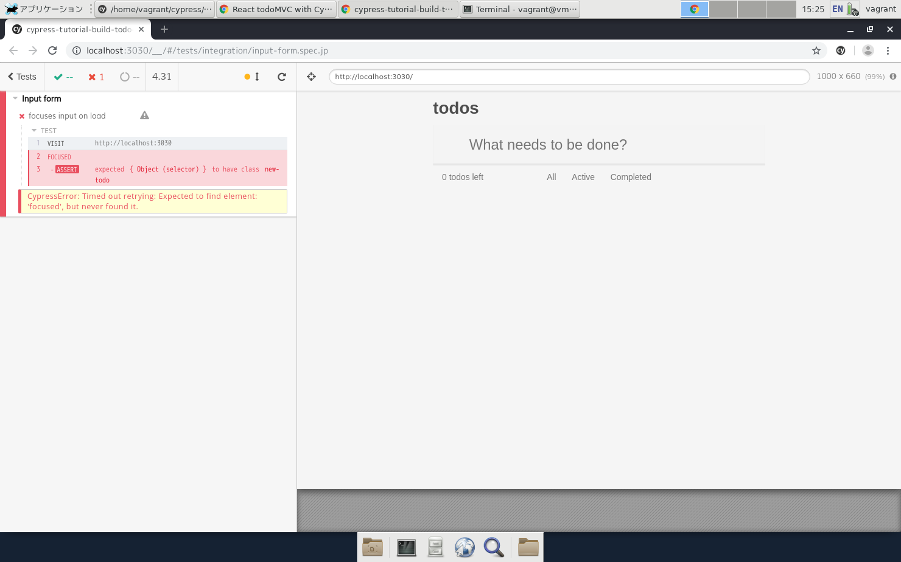
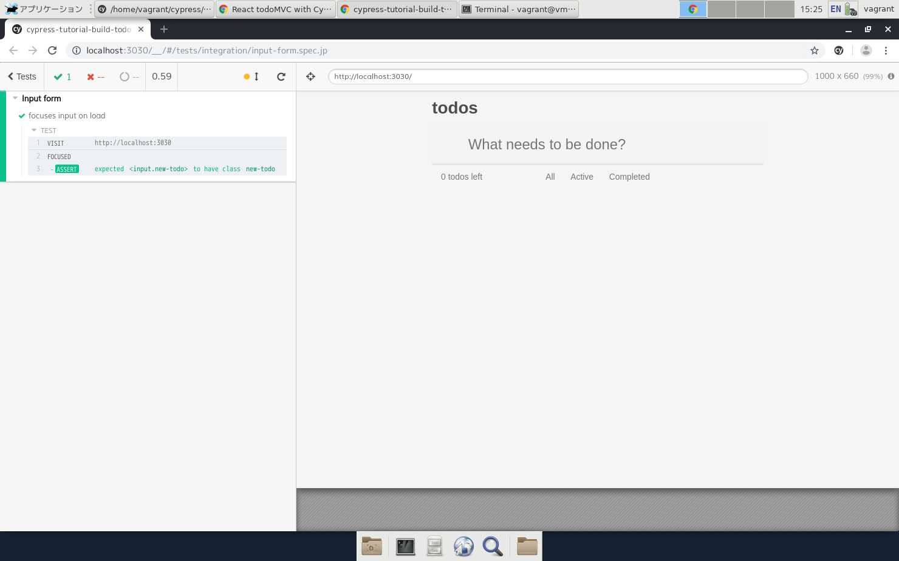
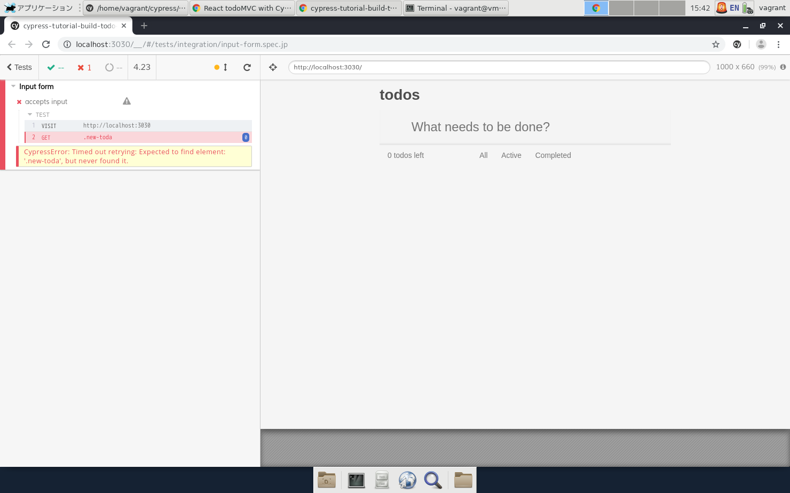

- 「cypress/integration/input-form.spec.js」に以下のコードを書いた直後はテストが失敗する。  
  理由はフォーカスする要素が不明なため。

```
        cy.focused()
            .should('have.class', 'new-todo')
```



- 「./src/components/TodoForm.js」に`autoFocus`を追加する。  
   ファイルを保存してcypressのテストを再実行するとgreenになる。



- 2番目のテストを追加する。そのテストだけを実行する場合は`it.only(〜)`と記述する。


- `cy.get('.new-toda')`のように存在しない要素を指定すると、タイムアウトしてredになる。



- 各テストの前に共通して実行する処理は`beforeEach`に記述する。

- 「cypress.json」で「baseUrl」を定義しておくことで、テストコードではURLを「/」で記述できる。

